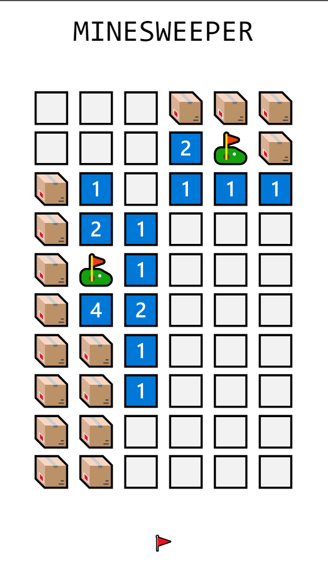
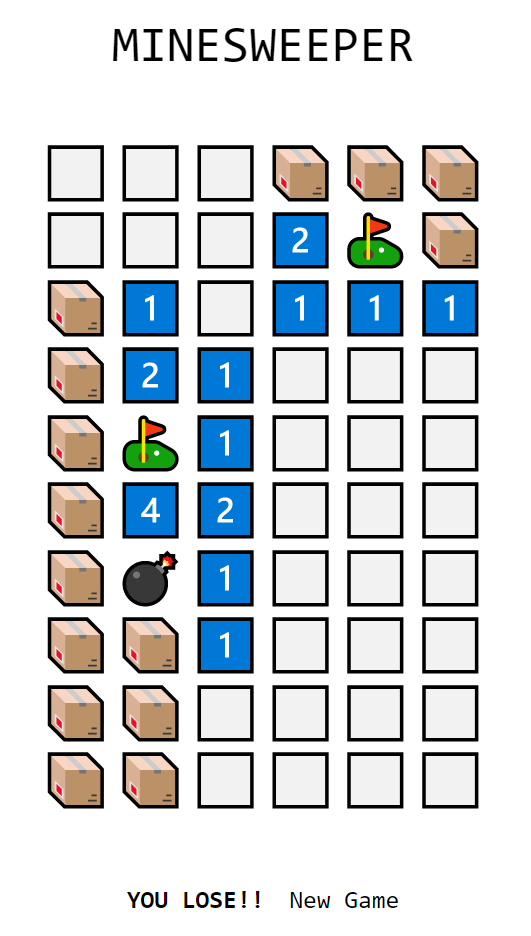
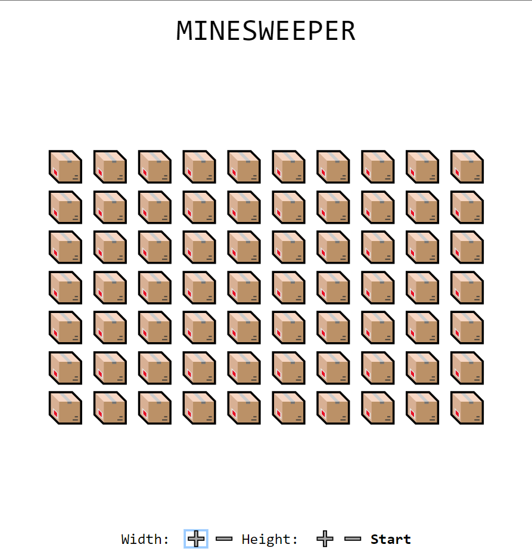

# Minesweeper Clone Using Elm

I built this Minesweeper clone while learning Elm. I have used all my functional programming 
knowledge to crete a program that is 100% functional programming code, made up of only pure 
functions, immutable data structures, modular code blocks etc. The UI is very minimal. Emojis
are used for images. The layout is responsive and number of mines can be adjusted

This is deployed [here](https://elm-minesweeper-sivakar12.netlify.app)

## How to run locally

- Install Elm
- Run `elm reactor` 
- Go to the URL output by the command
- open the file src/Main.elm

## Screenshots

